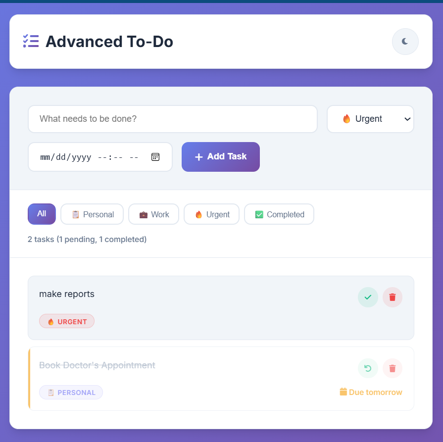
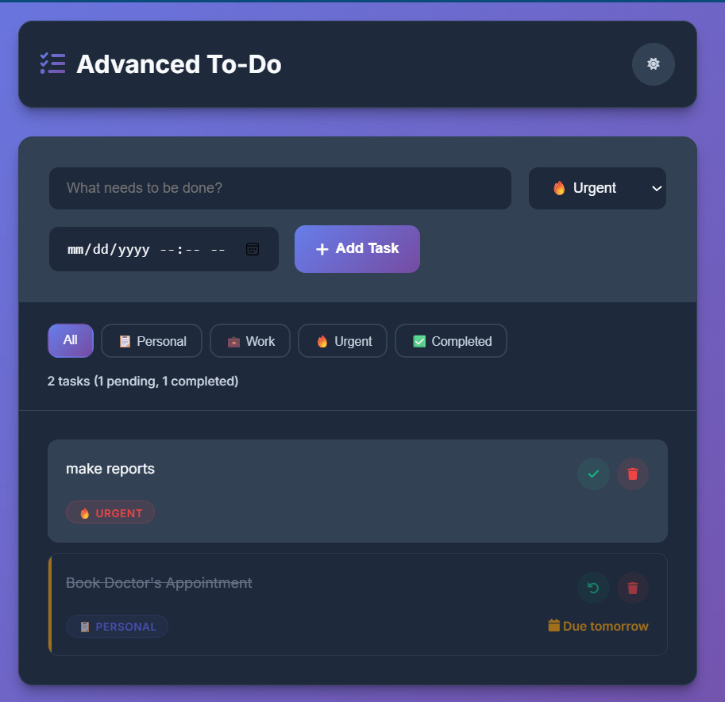
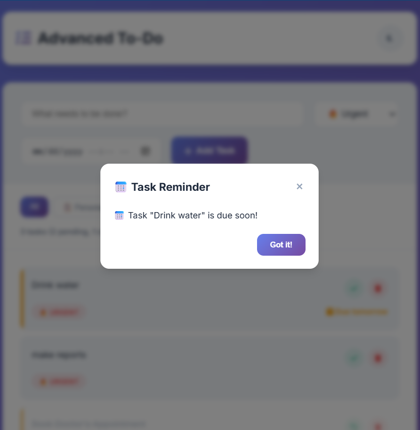

# 📝 Advanced To-Do List App

An advanced **Progressive Web App (PWA)** to-do list built with **HTML, CSS, and JavaScript**.  
This app lets you manage tasks with categories, due dates, reminders, and dark/light mode.  
It works **offline**, can be **installed like a mobile app**, and saves your tasks securely in **localStorage**.

---

## 🚀 Features

- ➕ Add, edit, and delete tasks
- 📂 Organize tasks by **categories** (Personal, Work, Urgent)
- 📅 Set **due dates & reminders** with modal + browser notifications
- 🌙 **Dark/Light mode** toggle with system preference detection
- 💾 **Offline support** via Service Worker (works without internet)
- 📱 **Installable as PWA** on desktop and mobile
- 🔍 **Filter system** – view all, personal, work, urgent, or completed tasks
- 📊 Task stats (pending vs completed)
- 💡 Export/Import tasks as JSON backup

---

## 📸 Screenshots

| Light Mode                 | Dark Mode                | Reminder                         |
| -------------------------- | ------------------------ | -------------------------------- |
|  |  |  |

---

## 🛠️ Tech Stack

- **Frontend:** Vanilla JavaScript (ES6+), HTML5, CSS3 (Flexbox, Grid)
- **PWA:** Service Worker, Manifest.json
- **Storage:** localStorage API (JSON-based persistence)
- **UI:** Font Awesome (icons), Google Fonts (Inter)

---

## 📂 Project Structure

```
📦 advanced-todo-app
 ┣ 📜 index.html        # Main UI
 ┣ 📜 style.css         # Styling (light/dark themes)
 ┣ 📜 script.js         # App logic (TodoApp class)
 ┣ 📜 sw.js             # Service worker (offline support)
 ┣ 📜 manifest.json     # PWA config
 ┗ 📜 README.md         # Documentation
```

---

## ⚙️ Installation & Usage

1. Clone this repository:

   ```bash
   git clone https://github.com/your-username/advanced-todo-app.git
   cd advanced-todo-app
   ```

2. Open in VS Code and run with **Live Server**  
   OR use a local server:

   ```bash
   npx serve
   ```

   Visit → `http://localhost:3000`

3. Add tasks, set reminders, and enjoy offline PWA support ✅

---

## 📦 Deployment

- **Netlify/Vercel** → Free hosting + HTTPS + PWA ready
- **GitHub Pages** → Works with `"start_url": "."` in `manifest.json`

---

## 📌 Future Enhancements

- 🔔 Push notifications with service worker
- 🗂️ Task priority levels (High/Medium/Low)
- 👥 Multi-user support with a backend (Node.js + MongoDB)
- 📱 Drag-and-drop task reordering
- 🌍 Multi-language support

---

## 👨‍💻 Author

**Sadaqath Ullah**  
💼 Passionate about building user-friendly web apps  
🌐 GitHub Profile: https://github.com/Sadaqath18
